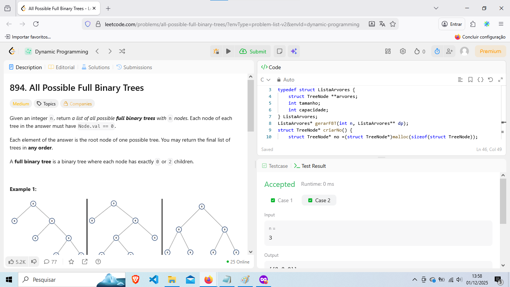

# Progamacao Dinamica!

**Número da Dupla**: 41<br>
**Conteúdo do Trabalho**: Progamacao Dinamica!<br>

## Alunos
|Matrícula | Aluno |
| -- | -- |
| 211031074 | João Pedro da Silva Rodrigues |
| 190128160 | Guilherme Maciel de Meneses |

## Sobre 
### Questões do Guilherme 
| Título | Responsável | Nível de Dificuldade | 
| -- | -- | -- |
| 1255. Maximum Score Words Formed by Letters| Guilherme Maciel | Díficil |
| 894. All Possible Full Binary Trees | Guilherme Maciel | Medio |

### Questões do João Pedro
| Título | Responsável | Nível de Dificuldade | 
| -- | -- | -- |
| 1092. Shortest Common Supersequence  | João Pedro | Díficil |
| 2742. Painting the Walls | João Pedro | Difícil | 


## Screenshots
### [(1092. Shortest Common Supersequence)](https://leetcode.com/problems/shortest-common-supersequence/description/)


### [ (2742. Painting the Walls)](https://leetcode.com/problems/painting-the-walls/description/)


### [(1255. Maximum Score Words Formed by Letters)](https://leetcode.com/problems/maximum-score-words-formed-by-letters/description/?envType=problem-list-v2&envId=dynamic-programming)


### [(894. All Possible Full Binary Trees)](https://leetcode.com/problems/all-possible-full-binary-trees/description/?envType=problem-list-v2&envId=dynamic-programming)

 


## Link do vídeo da apresentação da dupla 

[(Link do Vídeo)]()


## Guia de execução

### Questão 1092

rode o Python no leetcode: Joao_Pedro/1092.py 

```
Input: str1 = "abac", str2 = "cab"
Output: "cabac"
Explanation: 
str1 = "abac" is a subsequence of "cabac" because we can delete the first "c".
str2 = "cab" is a subsequence of "cabac" because we can delete the last "ac".
The answer provided is the shortest such string that satisfies these properties.


```

### Questão 2742 

rode o seguinte Python no leetcode: Joao_Pedro/2742.py 

```
Input: cost = [1,2,3,2], time = [1,2,3,2]
Output: 3
Explanation: The walls at index 0 and 1 will be painted by the paid painter, and it will take 3 units of time; meanwhile, the free painter will paint the walls at index 2 and 3, free of cost in 2 units of time. Thus, the total cost is 1 + 2 = 3.

```

### Questão 1255

rode o C: Guilherme/1255_Maximum_Score_Words_Formed_by_Letters.c

```
Input: words = ["dog","cat","dad","good"], letters = ["a","a","c","d","d","d","g","o","o"], score = [1,0,9,5,0,0,3,0,0,0,0,0,0,0,2,0,0,0,0,0,0,0,0,0,0,0]
Output: 23
Explanation:
Score  a=1, c=9, d=5, g=3, o=2
Given letters, we can form the words "dad" (5+1+5) and "good" (3+2+2+5) with a score of 23.
Words "dad" and "dog" only get a score of 21.

```


### Questão 894

rode o C: Guilherme/894_All_Possible_Full_Binary_Trees.c

```
Input: n = 7
Output: [[0,0,0,null,null,0,0,null,null,0,0],[0,0,0,null,null,0,0,0,0],[0,0,0,0,0,0,0],[0,0,0,0,0,null,null,null,null,0,0],[0,0,0,0,0,null,null,0,0]]

```


## Instalação 
<p>Compilador C/C++ instalado e Python 3 instalado </p> 


**Linguagem**: C, Python 3 <br>
