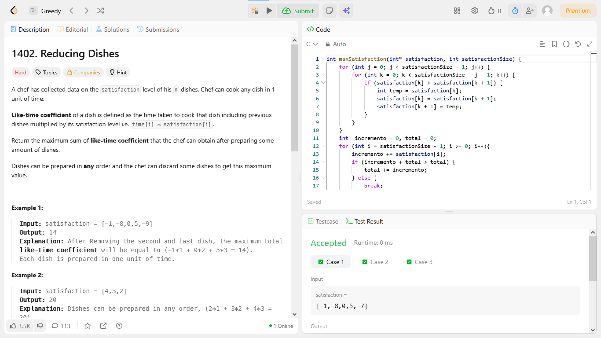
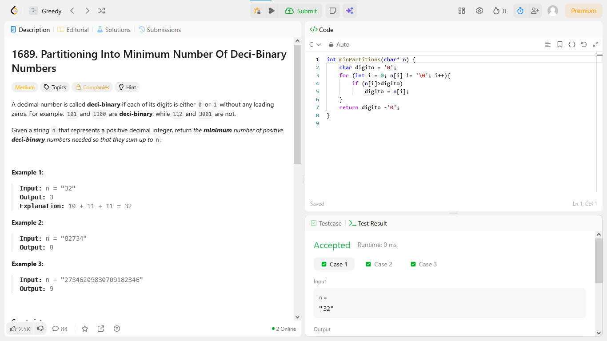

# Progamacao Dinamica!

**Número da Dupla**: 41<br>
**Conteúdo do Trabalho**: Progamacao Dinamica!<br>

## Alunos
|Matrícula | Aluno |
| -- | -- |
| 211031074 | João Pedro da Silva Rodrigues |
| 190128160 | Guilherme Maciel de Meneses |

## Sobre 
### Questões do Guilherme 
| Título | Responsável | Nível de Dificuldade | 
| -- | -- | -- |
| 1255. Maximum Score Words Formed by Letters| Guilherme Maciel | Díficil |
| 894. All Possible Full Binary Trees | Guilherme Maciel | Medio |

### Questões do João Pedro
| Título | Responsável | Nível de Dificuldade | 
| -- | -- | -- |
|44. Wildcard Matching | João Pedro | Díficil |
|135. Candy | João Pedro | Difícil | 


## Screenshots
### [(44. Wildcard Matching)](https://leetcode.com/problems/wildcard-matching/description/?envType=problem-list-v2&envId=greedy)


### [ (135. Candy)](https://leetcode.com/problems/candy/description/?envType=problem-list-v2&envId=greedy)


### [(1255. Maximum Score Words Formed by Letters)](https://leetcode.com/problems/maximum-score-words-formed-by-letters/description/?envType=problem-list-v2&envId=dynamic-programming)



### [(894. All Possible Full Binary Trees)](https://leetcode.com/problems/all-possible-full-binary-trees/description/?envType=problem-list-v2&envId=dynamic-programming)

 


## Link do vídeo da apresentação da dupla 

[(Link do Vídeo)](https://youtu.be/QxMIxEWsaZM)


## Guia de execução

### Questão 44

rode o C++: Joao_Pedro/44_WildcardMatching.cpp 

```
Input: s = "aa", p = "a"
Output: false
Explanation: "a" does not match the entire string "aa".


```

### Questão 135

rode o C++: Joao_Pedro/135_Candy.cpp 

```
Input: ratings = [1,0,2]
Output: 5
Explanation: You can allocate to the first, second and third child with 2, 1, 2 candies respectively.


```

### Questão 1255

rode o C: Guilherme/1255_Maximum_Score_Words_Formed_by_Letters.c

```
Input: words = ["dog","cat","dad","good"], letters = ["a","a","c","d","d","d","g","o","o"], score = [1,0,9,5,0,0,3,0,0,0,0,0,0,0,2,0,0,0,0,0,0,0,0,0,0,0]
Output: 23
Explanation:
Score  a=1, c=9, d=5, g=3, o=2
Given letters, we can form the words "dad" (5+1+5) and "good" (3+2+2+5) with a score of 23.
Words "dad" and "dog" only get a score of 21.

```


### Questão 894

rode o C: Guilherme/894_All_Possible_Full_Binary_Trees.c

```
Input: n = 7
Output: [[0,0,0,null,null,0,0,null,null,0,0],[0,0,0,null,null,0,0,0,0],[0,0,0,0,0,0,0],[0,0,0,0,0,null,null,null,null,0,0],[0,0,0,0,0,null,null,0,0]]

```


## Instalação 
<p>Compilador C/C++ instalado </p>


**Linguagem**: C, C++ <br>
